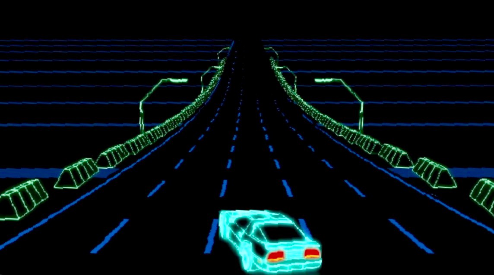

#  SwiftPyTorch


## Install Swift for Tensorflow
To install Swift for Tensorflow visit [https://github.com/tensorflow/swift/](https://github.com/tensorflow/swift/blob/master/Installation.md).


**Programatically Generating Xcode Projects with default settings / flags**    
There's a bunch of flags / settings needed to get up tensorflow up and and running with new xcode executable project. 
For new projects you can run
```shell
 brew install XcodeGen
 XcodeGen 
 ```
 to spit out new xcode projects. Just update the Sources.  
https://github.com/johndpope/swift-models/tree/stable/Inference     


Unfortunately - there's still a manual step to fix build system.
1. In the menu bar, select `File > Project Settings...`.
2. Then, select `Legacy Build System` for Build Settings and click `Done`.
 

## Install OpenAI Gym
Take the following steps to install OpenAI Gym using Miniconda:

      
     
## Install these for gymai

```shell
brew install cmake boost boost-python sdl2 swig wget
```
(if sdl2 fails / try proceeding without it)


https://conda.io/docs/_downloads/conda-cheatsheet.pdf    

  
**Setting up miniconda**      
```shell
brew install wget      
wget https://repo.continuum.io/miniconda/Miniconda3-latest-MacOSX-x86_64.sh      
chmod +x Miniconda3-latest-MacOSX-x86_64.sh      
./Miniconda3-latest-MacOSX-x86_64.sh      
```
      
      
**Add miniconda to user path / zsh**      
```shell
code ~/.zshrc      
export PATH="/Users/YOURUSERNAMENAMEHERE/miniconda3/bin:$PATH"      
```

     
**Install GymAI / pyTorch / sklearn**    
  
```shell
// https://conda.io/miniconda.html 
conda create -n gymai2  python=2.7.9
conda activate gymai2
pip install --upgrade pip
pip install "gym[atari]"
pip install sklearn

# for pytorch
pip install Cython 
pip install torch
pip install torchvision

```


**IMPORTANT**  
1.  Be sure to use python 2.7.9 to avoid missing python symbols  (__PyCodecInfo_GetIncrementalDecoder)   

2. There's a hack required to get  torchvision   to load testing / training data used in Pytorch.swift.   
 In your **Users/USERNAMEHERE/miniconda3/envs/gymai2/lib/python2.7/site-packages/**   
  rename **torchvision-0.2.1-py2.7.egg** file to    
      **torchvision-0.2.1-py2.7.zip**      
 unzip files to site-packages
3. You will need to update variable customClassPath in PyTorch.swift to point to  hard coded path of project Sources folder. Why? The app at runtime will read in the NeuralNet.py class
     **NeuralNet.py**    


**Troubleshooting**     
Ensure conda environment is correctly activate in pre-actions of xcode schema. 
         
**Schema >  Run > Pre-actions**
```
conda activate gymai2
```


